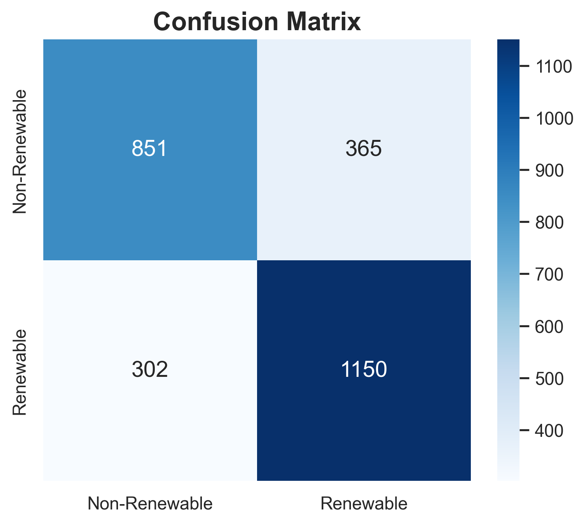

# Global Power Plant Energy Audit

Exploratory data analysis and classification of the [Global Power Plant Database](https://datasets.wri.org/dataset/globalpowerplantdatabase) to study whether global infrastructure is shifting from fossil fuels toward renewable energy.

> Originally built for a group AI course project. I was responsible for the data pipeline, modeling, and analysis.

## Approach

Cleaned and filtered the dataset to plants with valid country, fuel type, capacity, and commissioning year. Compared four classifiers, Logistic Regression, Random Forest, SVM, and KNN, on predicting renewable vs. non-renewable energy type from capacity, plant age, and country.

## Results



| Model | Accuracy |
|---|---|
| SVM | ~0.78 |
| KNN | ~0.77 |
| Random Forest | ~0.76 |
| Logistic Regression | lowest of the four |

All four models land within 1-2 points of each other. Accuracy has not yet been compared against the majority-class baseline.

## Stack

Python, pandas, NumPy, scikit-learn, matplotlib, seaborn

## Repo structure

```
├── notebooks/
│   └── energy_transition_audit.ipynb
├── figures/
│   ├── data_cleaning_audit.png
│   ├── capacity_pie.png
│   ├── fuel_bar.png
│   ├── age_trends.png
│   ├── renewable_breakdown_appendix.png
│   ├── confusion_matrix.png
│   └── feature_importance.png
├── README.md
└── requirements.txt
```

## Run locally

```bash
git clone https://github.com/<your-username>/global-power-plant-energy-audit.git
cd global-power-plant-energy-audit
pip install -r requirements.txt
jupyter notebook notebooks/energy_transition_audit.ipynb
```